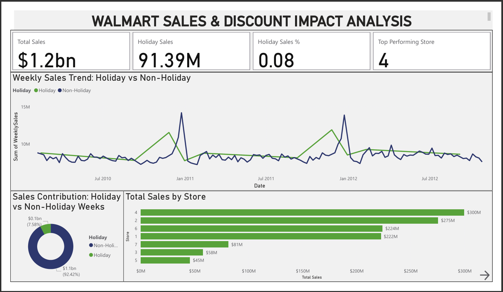
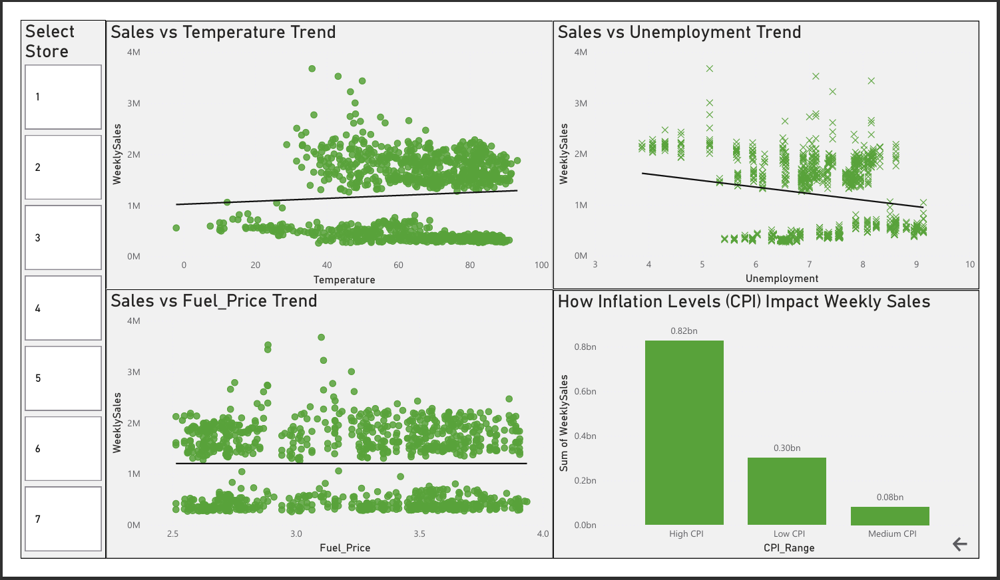

# 📊 Walmart Sales Performance Dashboard

This project presents an end-to-end analysis of Walmart’s weekly sales using **MySQL** for data cleaning and **Power BI** for dashboard creation. It explores store performance, holiday effects, and the impact of external factors like inflation (CPI), providing actionable retail insights using real-world data.

---

## 🎯 Objectives

- Clean and prepare Walmart’s raw retail data using SQL
- Analyze weekly sales trends across multiple stores
- Visualize the influence of holidays and inflation on performance
- Build a modern, multi-page Power BI dashboard with interactive filters
- Gain practical experience with real-world business data workflows

---

## 🔍 Project Highlights

- Real-world Walmart sales dataset sourced from Kaggle
- Used MySQL Workbench to clean and structure raw data
- Designed a professional Power BI dashboard with:
  - KPI cards for total sales and store count
  - Bar chart to highlight top-performing stores
  - Line and scatter charts for weekly trends
  - Area/column chart for CPI impact on sales
  - Button slicers for store-level analysis
- Separate pages for **sales overview** and **external factors**

---

## 🛠️ Tech Stack

- **MySQL Workbench** – data cleaning and structuring
- **Power BI** – dashboard creation and interactive analytics

---

## 📂 Files Included

| File Name                      | Description                                        |
|-------------------------------|----------------------------------------------------|
| `walmart_sales.csv`           | Raw dataset from Kaggle                            |
| `cleaned_walmart_sales.csv`   | Cleaned dataset used in Power BI                   |
| `walmart_sales.sql`           | SQL queries for cleaning and transformation        |
| `walmart_sales.pbix`          | Final Power BI dashboard file                      |
| `walmart_dashboard1.png`      | Page 1 – Sales Overview screenshot                 |
| `walmart_dashboard2.png`      | Page 2 – External Factors Impact screenshot        |
| `README.md`                   | This documentation file                            |

---

## 📈 Dashboard Preview

### 📄 Page 1 – Sales Overview

### 📄 Page 2 – External Factors Impact

---

## 📌 Key Insights

- 🏪 **Store 4** consistently achieved the highest total weekly sales; **Store 7** ranked the lowest.
- 📆 **Holiday weeks** showed irregular performance — boosting sales in some cases, dropping in others.
- 💹 **Sales trends held steady during high CPI periods**, suggesting pricing strength or non-discretionary product demand.
- 📉 Weekly sales trends revealed **mid-year dips and Quarter-4 spikes**, aligning with seasonal retail cycles.
- 🔍 **Store-wise comparisons** exposed performance gaps, highlighting opportunities for store-level strategy optimization.

---

## 📁 Dataset Source

> [Walmart Sales – Kaggle Dataset](https://www.kaggle.com/datasets/mikhail1681/walmart-sales)
